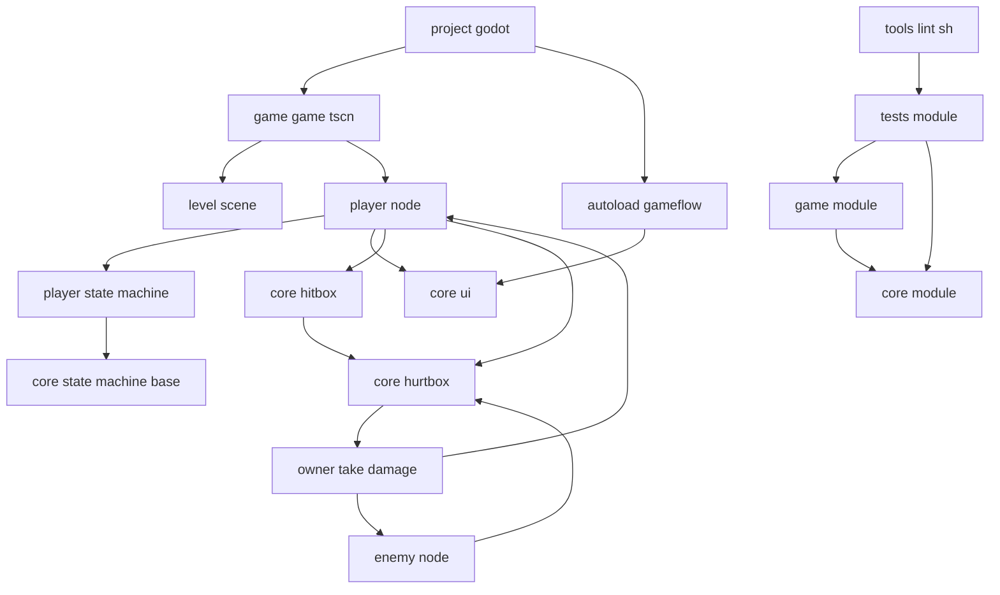

# 架构契约（Godot Platformer）

> 状态：Active Baseline（当前生效）
> 范围：以仓库当前实现为基线（as-is），并约束后续演进
> 读者：开发者 + Agent（实现、重构、评审）

## 1. 目标
- 在 Godot 场景化开发中保持功能持续可扩展。
- 防止边界漂移（`core -> game` 反向依赖、场景流分散、伤害链路被绕过）。
- 让开发行为与可执行事实一致（`tests/*.gd` + `tools/lint.sh`）。

## 2. 运行时拓扑（当前实现）
- 应用入口：`project.godot` -> `run/main_scene = res://game/game.tscn`。
- Autoload：`GameFlow = res://game/flow/game_flow_manager.gd`。
- 主场景（`res://game/game.tscn`）挂载：`Player`、`Level`、`InventoryUI`。
- 关卡场景（`res://game/world/levels/Level.tscn`）挂载：世界层、敌人实例、道具实例。

### 2.1 架构图

## 3. 模块边界契约
### 3.1 依赖方向
- 允许：`game -> core`
- 禁止：`core -> game`（包括 `res://game/*` 引用与具体 game 实体耦合）

### 3.2 场景流归属
- 切场景 / 重开 / 回主菜单 API 统一收敛到 `GameFlow`。
- `core/ui/**` 不直接依赖 `GameFlow`；UI 只发请求信号。

### 3.3 跨模块通信
- 编排事件优先使用 `signals`。
- 战斗交互优先使用 `Area2D` 边界（`Hitbox` / `Hurtbox`）。
- 禁止跨模块使用深链 `get_node("A/B/C")` 做业务逻辑访问。

## 4. 状态机契约
- 基础层：`core/state_machine/state.gd`、`core/state_machine/state_machine.gd`。
- Player 特化层：`game/player/player_state.gd`、`game/player/player_state_machine.gd`。
- Player 状态脚本目录：`game/player/states/*.gd`。
- Player 状态切换必须经过：`PlayerStateMachine.change_state()`。
- 非移动锁定状态必须具备 fail-safe：
  - 环境失效 -> 立即回退（通常 `FallState`）
  - 计时结束 -> 重新检查环境再决策下一状态
  - `exit()` 清理 lock timers/flags

## 5. 战斗/伤害契约
- 攻击发出边界：`core/combat/hitbox.gd` -> `area.hit(damage, source)`。
- 受击接收边界：`core/combat/hurtbox.gd` -> 所有者 `take_damage()`。
- 敌人攻击脚本不得直接调用玩家 `take_damage()`，必须经由 `Hurtbox.hit()`。
- 玩家生命值变更入口：`Player.take_damage(amount)`。

## 6. UI / 暂停契约
- Godot 4.5+ 语义：使用 `process_mode`，禁止 `pause_mode`。
- 暂停时仍可交互的 UI（如死亡界面、过渡层）必须设置 `Node.PROCESS_MODE_WHEN_PAUSED`。
- 场景切换动画通过 `GameFlow` + `TransitionManager` 执行。

## 7. 功能切片契约
- 功能目录应自闭环：`scene + script + resources + tests`。
- 当前切片示例：
  - `game/features/items/*`：自包含 `Area2D` 掉落物（group + signals）
  - `game/features/inventory/*`：库存 UI 模块（signals 与 Player 协作）
- 开发策略：`Vertical Slice First`，稳定后再抽象提取。

## 8. 命名 / 资源 / 类型规则
- 路径与文件名：`snake_case`
- Node 名：`PascalCase`
- `class_name`：仅用于全局可复用类型
- `.tscn/.tres`：禁止手写 UID
- `ext_resource`：path-first；UID 失效时删除 UID 保留有效路径
- 避免隐式 `Variant`（防止 warnings-as-errors）
- 禁止遮蔽 built-ins / member names
- 浮点计算意图需显式 `float(...)`

## 9. 碰撞层契约
- Player(1), Enemy(2), Terrain(3), PlayerAttack(4), EnemyAttack(5)

## 10. 可执行约束映射
### 10.1 Gate 链路
- `.githooks/pre-commit` -> `tools/pre_commit_scan.sh` -> `tools/lint.sh`
- `tools/lint.sh` 顺序：
1. `tools/check_headless_scene.sh`
2. `tools/run_tests.sh`
3. `tools/lint_architecture.sh`（默认 warning，`STRICT=1` 可升级为阻断）

### 10.2 已由测试强制的规则
- Core 路径依赖守卫：`tests/core_no_game_path_dependency_test.gd`
- core/ui 与 GameFlow 隔离：`tests/core_ui_no_game_flow_reference_test.gd`
- 场景流集中化：`tests/scene_changes_must_go_through_game_flow_test.gd`
- 敌人攻击禁止直接 take_damage：`tests/enemy_attacks_no_direct_take_damage_test.gd`
- 敌人攻击禁止 `is Player`：`tests/enemy_attacks_no_player_type_test.gd`
- Player 状态机文件位置守卫：`tests/player_state_location_test.gd`
- Player states 禁止 `class_name`：`tests/player_states_no_class_name_test.gd`
- Land/HardLand fail-safe：`tests/player_land_state_recovery_test.gd`
- 新脚本命名守卫（snake_case）：`tests/no_new_pascal_case_scripts_test.gd`

## 11. 变更策略
- 任何架构级改动必须在同一 PR 同步更新：
1. 本契约文档
2. 对应 tests/lint 规则
- 若代码与文档出现偏差：先以可执行行为（tests/lint）为准，并立即回写文档。

## 12. 评审清单
1. 是否引入 `core -> game` 反向依赖？
2. 是否在 `GameFlow` 之外切场景？
3. 是否绕过 `Hurtbox` 直接造成伤害？
4. 是否出现无 fail-safe 的状态迁移？
5. 是否违反路径/命名/UID/类型约束？
6. `./tools/lint.sh` 是否通过？
